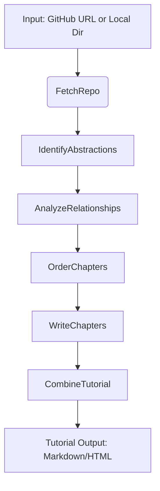

# **Chapter 1: Introduction & Vision**

> *"Every great developer was once a beginner."*  
> — And every great codebase should be **accessible** to them.

Welcome to **PocketFlow Tutorial Generator** — a revolutionary open-source tool that transforms complex software projects into **beginner-friendly, AI-powered tutorials**, automatically. Whether you're onboarding new team members, learning a new framework, or documenting your own work, this project turns code into clear, visual, and structured educational content — **with just one command**.

---

## 🎯 The Vision: Code That Teaches Itself

Modern software projects are powerful but often **inaccessible** to newcomers. Documentation is scattered, architecture is implicit, and the learning curve is steep. What if codebases could **explain themselves**?

Our vision is simple:  
> **Turn any repository into a self-documenting, educational experience — powered by AI.**

With **PocketFlow Tutorial Generator**, you don’t need to write documentation from scratch. Instead, the system:
- **Understands** your codebase using AI.
- **Identifies** core abstractions (classes, functions, design patterns).
- **Maps** how components interact.
- **Orders** concepts for optimal learning.
- **Writes** a structured, multilingual tutorial — complete with explanations, examples, and visual flow.

It’s like having an expert developer sit beside you and say:  
> *“Here’s what matters — and here’s how it all fits together.”*

---

## 🔧 What This Tool Does (And Why It Matters)

At its core, **PocketFlow Tutorial Generator** is a **modular AI agent pipeline** that analyzes code and generates tutorials. Here’s what it enables:

| Feature | Benefit |
|-------|--------|
| ✅ **GitHub + Local Repo Support** | Works on any public/private repo or local directory. |
| ✅ **AI-Powered Abstraction Detection** | Uses LLMs (Gemini, Claude, OpenAI) to find the *essence* of the code. |
| ✅ **Automatic Relationship Mapping** | Shows dependencies, data flow, and component interactions. |
| ✅ **Pedagogical Chapter Ordering** | Teaches concepts in the *right* sequence — not just file order. |
| ✅ **Multilingual Output** | Generate tutorials in **English, Spanish, Chinese, French**, and more. |
| ✅ **Filtering & Scoping** | Focus on relevant files (`*.py`, `*.ts`) and skip tests, logs, or binaries. |
| ✅ **Docker & CLI Ready** | Run locally, in CI, or containerized — no setup headaches. |
| ✅ **Caching & Efficiency** | Avoids redundant AI calls; saves time and cost. |

Whether you’re:
- A **learner** trying to understand a new framework (e.g., FastAPI, Flask),
- A **maintainer** onboarding new contributors,
- Or a **teacher** building course material,

…this tool **lowers the barrier to entry** for everyone.

---

## 🧠 How It Works: A High-Level Architecture

The system is built around **seven core architectural components**, orchestrated by the **PocketFlow** framework — a lightweight, agentic workflow engine.

Here’s the end-to-end flow:



### 🔍 Key Components at a Glance

| Component | Role |
|--------|------|
| **`FetchRepo`** | Downloads and filters files (with `.gitignore`, size limits, patterns). |
| **`IdentifyAbstractions`** | Asks: *"What are the key concepts in this code?"* — returns classes, patterns, functions. |
| **`AnalyzeRelationships`** | Asks: *"How do these concepts interact?"* — builds a dependency map. |
| **`OrderChapters`** | Asks: *"What should a beginner learn first?"* — creates a logical sequence. |
| **`WriteChapters`** | Generates **per-chapter explanations** with code snippets and analogies. |
| **`CombineTutorial`** | Merges chapters into a single, polished document (Markdown/HTML). |
| **`CallLLM`** | Unified interface to

# **Chapter 2: System Overview & High-Level Architecture**

## **Objective**
In this chapter, you’ll gain a comprehensive understanding of how the **AI-Powered Codebase Tutorial Generator** works end-to-end. We’ll walk through the high-level architecture, explain the core components, and show how they interact to transform any codebase — whether from GitHub or your local machine — into a beginner-friendly, multilingual tutorial with visualizable structure.

By the end of this chapter, you’ll understand:
- The **overall data flow** from code input to final tutorial output.
- The **modular design** powered by *PocketFlow* agents.
- The **key architectural abstractions** and their responsibilities.
- How **LLMs are used** to reason about code, not just generate text.
- How to **extend or customize** the system for your own use cases.

---

## **2.1 End-to-End Flow: From Code to Tutorial**

Let’s start with the big picture. Here’s what happens when you run:

```bash
python main.py --repo https://github.com/encode/fastapi --language english
```

### 🔁 **Step-by-Step Pipeline**

| Step | Component | What It Does |
|------|---------|-------------|
| 1️⃣ | `FetchRepo` | Downloads or reads the codebase using pattern filters and size limits. |
| 2️⃣ | `IdentifyAbstractions` | Uses an LLM to detect core concepts (e.g., `FastAPI`, `APIRouter`, `Dependency`) in the code. |
| 3️⃣ | `AnalyzeRelationships` | Asks the LLM how these abstractions relate (e.g., "`APIRouter` is used by `FastAPI`"). |
| 4️⃣ | `OrderChapters` | Determines a logical learning order (e.g., start with `FastAPI`, then `APIRouter`). |
| 5️⃣ | `WriteChapters` *(Batch)* | Generates detailed, beginner-friendly explanations for each abstraction — in parallel. |
| 6️⃣ | `CombineTutorial` | Merges all chapters into a single structured document (Markdown/HTML), including summary and metadata. |

> 💡 **All steps are orchestrated by `TutorialFlow`**, a PocketFlow-based DAG (Directed Acyclic Graph) defined in `flow.py`.

---

## **2.2 High-Level Architecture Diagram**

```
+------------------+
|   User Input     |
| (CLI: repo/dir)  |
+--------+---------+
         |
         v
+------------------+
|  main.py         | <--- Entrypoint: Parses args, sets up shared context
+--------+---------+
         |
         v
+------------------+
|  TutorialFlow    | <--- PocketFlow orchestrator (flow.py)
+--------+---------+
         |
         +------------------> [FetchRepo]
         |                         |
         |                         v
         |                [IdentifyAbstractions] → LLM → YAML
         |                         |
         |                         v
         |                [AnalyzeRelationships] → LLM → Summary + Graph
         |                         |
         |                         v
         |                [OrderChapters] → LLM → Chapter Order
         |                         |
         |                         v
         |                [WriteChapters] → LLM (Batch) → Per-chapter content
         |                         |
         |                         v
         +----------------> [CombineTutorial] → Final Tutorial (MD/HTML)
                                   |
                                   v
                         +------------------+
                         |  ./output/       | ← Generated tutorial
                         |  (by language)   |
                         +------------------+
```

> 🔗 **Data flows via a shared dictionary** (`shared`) passed between nodes. This includes:
> - `files`: List of `(path, content)` tuples
> - `abstractions`: Extracted concepts
> - `relationships`: How they interact
> - `chapters`: Ordered list of abstraction indices
> - `chapter_contents`: Generated explanations
> - `project_summary`, `language`, `repo_url`, etc.

---

## **2.3 Core Architectural Abstractions**

Let’s dive into the **7 key components** that make this system powerful, modular, and extensible.

### **1. `TutorialFlow` – The Orchestrator**
- **Defined in**: `flow.py`, `main.py`
- **Framework**: [PocketFlow](https://github.com/The-Pocket/PocketFlow) (lightweight agentic workflow engine)
- **Role**: Chains nodes together using `>>` syntax and manages execution order.
- **Features**:
  -

# **Chapter 3: Setting Up Your Environment**

**Objective**: Prepare your system to run and experiment with the AI-powered codebase tutorial generator.

By the end of this chapter, you'll have a fully configured development environment capable of analyzing GitHub repositories or local codebases and generating beginner-friendly, multilingual tutorials — all powered by Large Language Models (LLMs) and the lightweight **PocketFlow** agent framework.

---

## **1. Prerequisites**

Before you begin, ensure the following tools are installed on your machine:

| Tool | Purpose | Installation |
|------|--------|--------------|
| **Python 3.10+** | Core runtime for the application | [python.org](https://www.python.org/downloads/) |
| **Git** | Clone repositories and manage source control | [git-scm.com](https://git-scm.com/) |
| **Docker** (optional) | Run the app in an isolated container | [docker.com](https://www.docker.com/products/docker-desktop/) |
| **LLM API Key** | Required for Gemini, Claude, or OpenAI | See [API Key Setup](#3-api-key-setup) |

> 💡 **Note**: While Docker simplifies setup, you can run everything directly with Python if preferred.

---

## **2. Clone the Project**

Start by cloning the repository:

```bash
git clone https://github.com/your-org/pocketflow-tutorial-generator.git
cd pocketflow-tutorial-generator
```

> 🔄 Replace the URL with the actual repo if different. The structure should include:
> - `main.py` – CLI entrypoint
> - `flow.py` – Pipeline orchestration
> - `nodes.py` – Core logic modules
> - `utils/` – Helper tools (`call_llm.py`, `crawl_github_files.py`, etc.)
> - `Dockerfile` – Container definition
> - `requirements.txt` – Python dependencies

---

## **3. API Key Setup**

The system uses LLMs (like **Google Gemini 2.5 Pro**, **Anthropic Claude 3.7**, or **OpenAI O1**) to analyze code and generate tutorials.

### ✅ **Recommended: Use Environment Variables**

Set your API key securely using environment variables:

#### For **Google Gemini** (default provider):
```bash
export GEMINI_API_KEY="your-gemini-api-key-here"
```

#### For **Anthropic Claude**:
```bash
export ANTHROPIC_API_KEY="your-anthropic-api-key-here"
```

#### For **OpenAI / Azure / OpenRouter**:
```bash
export OPENAI_API_KEY="..."          # For OpenAI
# OR
export OPENROUTER_API_KEY="..."      # For OpenRouter
```

> 🔐 **Best Practice**: Never commit API keys to version control. Use `.env` files or shell profiles (e.g., `.zshrc`, `.bash_profile`) to store them.

> 🛠️ **Switching Providers**: Open `utils/call_llm.py` and comment/uncomment the desired `call_llm` implementation. The rest of the code remains unchanged.

---

## **4. Install Dependencies**

### Option A: **Native Python (Recommended for Development)**

Install required packages:

```bash
pip install -r requirements.txt
```

> 📦 Key dependencies include:
> - `google-generativeai`, `openai`, `anthropic` – LLM clients
> - `requests` – GitHub API access
> - `PyYAML` – Parse LLM responses
> - `pathspec` – `.gitignore` support
> - `PocketFlow` – Lightweight workflow engine

### Option B: **Docker (Recommended for Reproducibility & Production)**

Build the image using the provided `Dockerfile`:

```bash
docker build -t pocketflow-tutorial-gen .
```

> ✅ The Dockerfile:
> - Uses `python:3.10-slim` for minimal footprint
> - Installs `git` for GitHub cloning
> - Copies code and installs Python packages
> - Sets `main.py` as the entrypoint

> ⚠️ **Security Note**: By default, the container runs as root. For production, consider adding a non-root user:
> ```Dockerfile
> RUN useradd -m -s /bin/bash appuser
> USER appuser
> ```

> 📝 **Tip**: Add a `.dockerignore` file to exclude logs, cache, and IDE files:
> ```
> __pycache__
> *.pyc
> .git
> .vscode
> logs/
> llm_cache.json
> ```

---

## **5. Configure Input & Output**

The

# **Chapter 4: Deep Dive – Fetching the Codebase**  
**Objective**: Understand how the system ingests and filters source code.

Before any AI can analyze a codebase, it must first **fetch** the right files — not too many, not too few — in a way that's efficient, safe, and reproducible. This chapter takes you behind the scenes of how the system retrieves code from **GitHub repositories** or **local directories**, applies intelligent filtering, and prepares it for analysis.

We’ll explore:
- How the system fetches code from GitHub or your local machine
- How it filters files using patterns and `.gitignore`
- How file size and structure are managed to avoid overload
- The role of caching and resilience in the pipeline

Let’s dive into the **core ingestion engine** of the tutorial generator.

---

## 🔍 **1. The Entry Point: `FetchRepo` Node**

At the start of every tutorial generation flow is the `FetchRepo` class in `nodes.py`. This is the **gatekeeper** of the pipeline — responsible for retrieving source files and passing them downstream.

```python
class FetchRepo(Node):
    def prep(self, shared):
        # Get configuration from shared context
        repo_url = shared.get("repo_url")
        local_dir = shared.get("dir")
        include_patterns = shared.get("include_patterns", ["*.py", "*.js", "*.ts", "*.go", "*.rs", "*.md", "*.txt", "*.html", "*.css", "*.json", "*.yaml", "*.yml"])
        exclude_patterns = shared.get("exclude_patterns", ["*test*", "*spec*", "*.log", "__pycache__/*", "node_modules/*", ".git/*", ".venv/*", "dist/*", "build/*"])
        max_file_size = shared.get("max_file_size", 100 * 1024)  # 100 KB default
        use_relative_paths = True

        # Choose source: GitHub or local
        if repo_url:
            return crawl_github_files(
                repo_url=repo_url,
                token=shared.get("github_token"),
                max_file_size=max_file_size,
                use_relative_paths=use_relative_paths,
                include_patterns=set(include_patterns),
                exclude_patterns=set(exclude_patterns)
            )
        else:
            return crawl_local_files(
                directory=local_dir,
                include_patterns=set(include_patterns),
                exclude_patterns=set(exclude_patterns),
                max_file_size=max_file_size,
                use_relative_paths=use_relative_paths
            )
```

> ✅ **Key Insight**: `FetchRepo` is **source-agnostic**. Whether the code lives on GitHub or your laptop, the same filtering logic applies.

---

## 🌐 **2. Fetching from GitHub: Smart Crawling with API or Git**

When a GitHub URL is provided (e.g., `--repo https://github.com/encode/fastapi`), the system uses `crawl_github_files.py` to retrieve files.

### 🔧 **Two Modes of Operation**

| Mode | When Used | How It Works |
|------|-----------|-------------|
| **GitHub API Mode (HTTPS URL)** | Default for public/private repos | Uses GitHub’s `/contents` REST API to list and download files recursively. Supports branches, commits, and subdirectories (e.g., `tree/main/src`). |
| **Git Clone Mode (SSH URL)** | Fallback for SSH or complex cases | Clones the repo into a temporary directory using `git`, then reads files locally. Less efficient but more reliable for private repos with SSH access. |

### 🛡️ **Security & Rate Limiting**
- Uses `GITHUB_TOKEN` (from env or CLI) to access private repos and avoid rate limits.
- Automatically pauses and retries when hitting GitHub API rate limits (403 responses).
- Validates file size **before** downloading to prevent memory bloat.

### 🎯 **Pattern Filtering**
Files are filtered using **glob-style patterns**:
```python
include_patterns = {"*.py", "*.md"}
exclude_patterns = {"*test*", "*.log"}
```
This ensures only relevant source and documentation files are included — skipping tests, logs, binaries, and build artifacts.

> 💡 **Pro Tip**: You can customize these patterns via CLI flags:
> ```bash
> --include "*.py" "*.md" --exclude "tests/*" "*.min.js"
> ```

---

## 💾 **3. Fetching from Local Directories: `.gitignore`-Aware Crawling**

When analyzing a local project