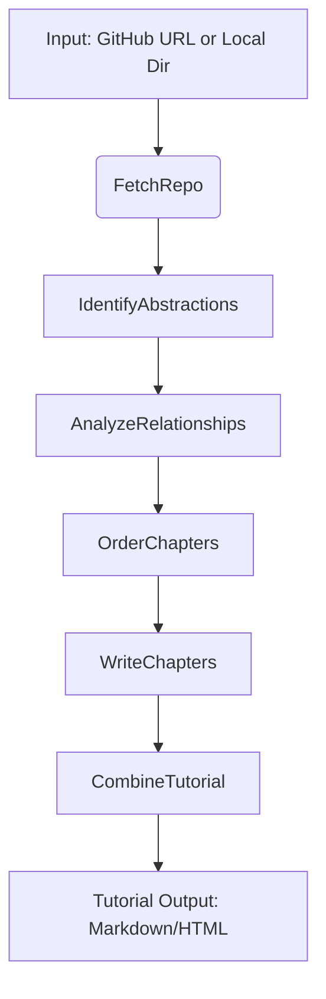

# **Chapter 1: Introduction & Vision**

> *"Every great developer was once a beginner."*  
> — And every great codebase should be **accessible** to them.

Welcome to **PocketFlow Tutorial Generator** — a revolutionary open-source tool that transforms complex software projects into **beginner-friendly, AI-powered tutorials**, automatically. Whether you're onboarding new team members, learning a new framework, or documenting your own work, this project turns code into clear, visual, and structured educational content — **with just one command**.

---

## 🎯 The Vision: Code That Teaches Itself

Modern software projects are powerful but often **inaccessible** to newcomers. Documentation is scattered, architecture is implicit, and the learning curve is steep. What if codebases could **explain themselves**?

Our vision is simple:  
> **Turn any repository into a self-documenting, educational experience — powered by AI.**

With **PocketFlow Tutorial Generator**, you don’t need to write documentation from scratch. Instead, the system:
- **Understands** your codebase using AI.
- **Identifies** core abstractions (classes, functions, design patterns).
- **Maps** how components interact.
- **Orders** concepts for optimal learning.
- **Writes** a structured, multilingual tutorial — complete with explanations, examples, and visual flow.

It’s like having an expert developer sit beside you and say:  
> *“Here’s what matters — and here’s how it all fits together.”*

---

## 🔧 What This Tool Does (And Why It Matters)

At its core, **PocketFlow Tutorial Generator** is a **modular AI agent pipeline** that analyzes code and generates tutorials. Here’s what it enables:

| Feature | Benefit |
|-------|--------|
| ✅ **GitHub + Local Repo Support** | Works on any public/private repo or local directory. |
| ✅ **AI-Powered Abstraction Detection** | Uses LLMs (Gemini, Claude, OpenAI) to find the *essence* of the code. |
| ✅ **Automatic Relationship Mapping** | Shows dependencies, data flow, and component interactions. |
| ✅ **Pedagogical Chapter Ordering** | Teaches concepts in the *right* sequence — not just file order. |
| ✅ **Multilingual Output** | Generate tutorials in **English, Spanish, Chinese, French**, and more. |
| ✅ **Filtering & Scoping** | Focus on relevant files (`*.py`, `*.ts`) and skip tests, logs, or binaries. |
| ✅ **Docker & CLI Ready** | Run locally, in CI, or containerized — no setup headaches. |
| ✅ **Caching & Efficiency** | Avoids redundant AI calls; saves time and cost. |

Whether you’re:
- A **learner** trying to understand a new framework (e.g., FastAPI, Flask),
- A **maintainer** onboarding new contributors,
- Or a **teacher** building course material,

…this tool **lowers the barrier to entry** for everyone.

---

## 🧠 How It Works: A High-Level Architecture

The system is built around **seven core architectural components**, orchestrated by the **PocketFlow** framework — a lightweight, agentic workflow engine.

Here’s the end-to-end flow:

### 🔍 Key Components at a Glance

| Component | Role |
|--------|------|
| **`FetchRepo`** | Downloads and filters files (with `.gitignore`, size limits, patterns). |
| **`IdentifyAbstractions`** | Asks: *"What are the key concepts in this code?"* — returns classes, patterns, functions. |
| **`AnalyzeRelationships`** | Asks: *"How do these concepts interact?"* — builds a dependency map. |
| **`OrderChapters`** | Asks: *"What should a beginner learn first?"* — creates a logical sequence. |
| **`WriteChapters`** | Generates **per-chapter explanations** with code snippets and analogies. |
| **`CombineTutorial`** | Merges chapters into a single, polished document (Markdown/HTML). |
| **`CallLLM`** | Unified interface to